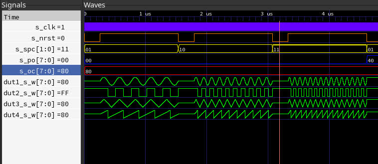

# Generic Function Generator

This project implements a generic function generator in VHDL,
designed to be compatible with various FPGAs and compile using Quartus Prime. 
It adheres to the VHDL 2008 standard, ensuring modern and efficient implementation practices. 
The function generator comprises modules for generating a diverse range of waveforms,
including sine, square, triangular, and sawtooth waves. 
It is designed with a generic architecture, 
enabling users to customize parameters such as waveform type, frequency,
phase offset, and resolution according to their specific requirements.

## Project Structure

- [Makefile](Makefile)
- src/
  - [counter.vhd](src/counter.vhd)
  - [f_sawtooth.vhd](src/f_sawtooth.vhd)
  - [f_sine.vhd](src/f_sine.vhd)
  - [f_square.vhd](src/f_square.vhd)
  - [f_triangular.vhd](src/f_triangular.vhd)
  - [top.vhd](src/top.vhd)
- test/
  - [counter_tb.vhd](test/counter_tb.vhd)
  - [f_sawtooth_tb.vhd](test/f_sawtooth_tb.vhd)
  - [f_sine_tb.vhd](test/f_sine_tb.vhd)
  - [f_square_tb.vhd](test/f_square_tb.vhd)
  - [f_triangular_tb.vhd](test/f_triangular_tb.vhd)

## Usage

### Simulation with GHDL

To simulate the VHDL files using GHDL, follow these steps:

1. Ensure you have GHDL installed.
2. Open a terminal.
3. Navigate to the project directory.
4. Run `make` to compile and execute the testbenches.
5. After simulation, waveform files (`*.vcd`) will be generated in current directory.

### Synthesis with Quartus Prime

To synthesize the VHDL files using Quartus Prime, follow these steps:

1. Open Quartus Prime.
2. Create a new project and add the VHDL files (`*.vhd`) from the `src` directory.
3. Ensure that the VHDL standard is set to VHDL 2008.
4. Set the top-level entity to `top.vhd` to specify the main entity of your design.
5. Compile the project.
6. Perform design analysis and synthesis.
7. Configure the FPGA device with the generated programming file (e.g., `.sof` or `.pof`).

## Compatibility

This project is compatible with Altera FPGAs and has been tested with Quartus Prime. 
The VHDL files are written with VHDL 2008 syntax, 
so it's important to configure the synthesis tool (such as Quartus Prime) to support VHDL 2008
features for proper synthesis and implementation.

## License

This project is licensed under the MIT License. 
See the [LICENSE](LICENSE) file for details.
